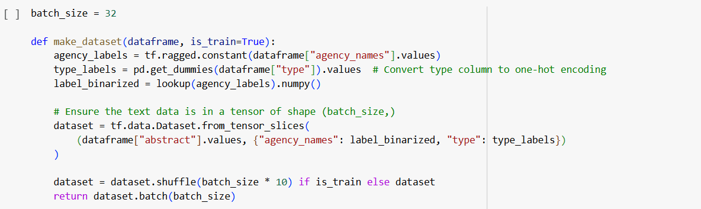

# 2024_ia653_raavi_govindagari

Code for 2024 IA653 Final Project. Teammates Poorna Raavi and Shiva Prasad

Course: Natural Language Processing

# Project Title: Text Analysis and Retrieval for Federal Datasets

## Project Overview

This project focuses on using Natural Language Processing (NLP) techniques to analyze and extract meaningful insights from federal dataset. The dataset contains diverse textual data, which we aim to process and utilize for three key tasks.

## Project Goals

**Multilabel Classification**  
 Develop a multi-label classification model for that predicts multiple agency names and document types (Rule, Proposed Rule, or Notice) based on abstract text using Naive Bayes and Neuarl Networks

# Dataset Details

### Motivation

The dataset was collected from the Federal Register to explore applications in legal and governmental text processing. We downloaded dataset through the Federal Register API.

### Collection Process

- Size: 10,000 documents.
- Sampling: Downloaded via API, prioritizing recent entries.
- Consent: Data is public domain, as provided by the Federal Register.
- Preprocessing: lemmatization, stopword removal, and tokenization.
- Metadata: Contains document numbers, titles, abstracts, agency names, type, URLs, and excerpts.

# Multi-label Classfication

### Reference: https://keras.io/examples/nlp/multi_label_classification/

### Process overview

The dataset is downloaded from the Federal Register API, preprocessed by cleaning and lemmatizing text, and the labels are binarized using multi-hot encoding. The model is trained using a neural network with separate output layers for agency prediction (multi-label) and document type classification (multi-class). After training, predictions are made on test and unseen data, evaluating the model's accuracy, precision, recall, F1-score in predicting the agencies and document type.

In addition, a Naive Bayes approach is implemented as a baseline model. The TF-IDF vectorizer converts the text into feature vectors, which are then used by a Multinomial Naive Bayes classifier for agency prediction (multi-label) and document type classification (multi-class). The Naive Bayes model is also evaluated on validation and test data

## Exploratory Data Analysis (EDA)

**Total Number of Documents**: The code calculates the total number of unique documents by extracting document_number from the JSON file.

**Number of Documents per Category/Agency**: Dropped rows with missing abstracts or agencies. Extracted agency names into a separate column. Counted the number of documents associated with each agency. The top 10 agencies with the highest document counts are displayed.

**Number of Agencies per Document**: Calculated how many agencies are associated with each document. Identified the document with the maximum number of agencies and printed its details.

**Average Word Length in Abstracts**: Concatenated all abstracts, defined a function 'letterCounter' to count word lengths and calculated the mean word length. The average word length across the dataset indicates the complexity of the vocabulary used.

**Average Word Length per Document**: Calculated the average word length for each document's abstract. Sorted documents by average word length.

**Agency Collaboration**: Identified documents involving multiple agencies. Printed the top 10 most common agency pairs in collaborations.

## Preprocessing Steps

### Text Cleaning

- Lowercased text.
- Removed stop words using NLTK's predefined stop word list.
- Tokenized text using the regex r'(\b[\w]{2,}\b)' to extract alphanumeric words of length ≥2.
- Applied lemmatization using WordNetLemmatizer.

### Prepared Abstracts

Cleaned and preprocessed the abstract column for downstream tasks like vectorization and modeling.

## Multi-label binarization

The StringLookup layer is used to preprocess multi-label data by converting text labels into a multi-hot encoded format. The lookup.adapt() method learns the vocabulary from the dataset, and the invert_multi_hot() function decodes the multi-hot labels back into their original text form for interpretation.

## Datasets preparation

The function 'make_dataset' prepares datasets for training, validation, and testing by encoding text and labels into tensors. It processes the abstract as input and creates multi-hot and one-hot encoded labels for 'agency_names' and 'type'. The data is shuffled for training and batched with a size of 32.

**Inspecting a Batch of Data**: This code extracts a batch from the training dataset and inspects the first 10 examples. It decodes the multi-hot encoded agency_names back into text and determines the type (rule, notice, or proposed rule) by interpreting the one-hot encoded type labels. The abstract, agency names, and type are printed for each example.

## Text Vectorization

The vocabulary is prepared from the training abstracts, and a TextVectorization layer is configured to convert text into TF-IDF representations with bigrams. The vectorizer is adapted to the training data and then applied to the train, validation, and test datasets, enabling efficient preprocessing with parallelism and prefetching.

## Model Fitting

### Train/Test Splitting

**Splitting Process**: The dataset was split into training (80%) and test (20%) sets using the train_test_split function with test_size=0.2.
From the test set, a validation set was created by sampling 50% of the test set. The corresponding indices were then dropped from the test set to avoid overlap.

**Decision on Train/Test Sizes**: The 80-20 split ratio was chosen as it provides enough data for training while reserving a reasonable portion for testing and validation. This ensures that the model generalizes well to unseen data.

### Model Selection

**Selected Models**:

- Two models were implemented to solve this problem
- A multi-label classification neural network to predict agency names (multi-label task) and document type (multi-class task).
- A Naive Bayes classifier to compare performance against the neural network.

**Reason for Model Choice**:

- The task involves text data with multi-label and multi-class outputs, making neural networks well-suited due to their capacity for modeling complex relationships and handling.

- Naive Bayes was implemented as a simpler, baseline approach to evaluate whether its probabilistic modeling could perform competitively for the given dataset.
  high-dimensional data.

**Deep Learning Models**:

- Neural networks and text vectorization layers were employed to leverage semantic relationships and TF-IDF representations for enhanced accuracy.

- The Naive Bayes model uses TF-IDF representations to classify the data

### Model Summary

**Summary Description**:

**Neural Network implementation**

- **Input**: A `Text Vectorization` layer with a vocabulary size of 12,915 converts abstracts into TF-IDF vectors.

- **Agency Names Classification (Multi-Label):**
- Hidden Layers: Dense layers with 512, 256, and 128 units using ReLU activation.
- Output Layer: Dense layer with 202 units and sigmoid activation for multi-label classification.

- **Type Classification (Multi-Class)**:

- Hidden Layers: Dense layers with 512, 256, and 128 units using ReLU activation.
- Output Layer: Dense layer with 3 units and SoftMax activation for multi-class classification.

- **Optimization and Loss**: Used Adam optimizer, binary cross-entropy for agency names, and categorical cross-entropy for type classification.

- **Total Parameters**: 13.58M

- **Early Stopping**: Monitors validation loss with a patience of 3 epochs, ensuring optimal performance without overfitting.

**Naive Bayes Implementation**:

- **Input**: TF-IDF Vectorizer with a maximum of 5000 features and bi-grams used to convert abstracts into feature vectors.
- **Preparing Labels**:
  Agency labels are converted into numerical format using a lookup table on ragged tensors, while type labels are one-hot encoded using pandas 'get_dummies' method for multi-label classification.
- **Classifier**: Multinomial Naive Bayes wrapped in a MultiOutputClassifier for multi-label prediction.

## Validation/Metrics

**Accuracy**: Accuracy was used to evaluate the model's overall performance. It was specifically weighed heavily for agency name prediction and type classification due to the need for the model to correctly classify a large number of categories.

**Precision:**
Precision measures how many of the predicted positive labels are actually correct. For agency prediction, a micro-average approach was used to account for class imbalance, ensuring that the model's precision is evaluated across all classes proportionally. For type prediction, a macro-average was used, as each type is assumed to have similar importance, treating all classes equally in evaluating precision.

**Recall:**
Recall reflects how many actual positive labels the model correctly identified.

**F1 Score:**
The F1 score provides a balance between precision and recall.

### Training and validation Metrics

**Naive Bayes**

- Agency prediction Precision on the validation set: 90.78%
- Agency prediction Recall on the validation set: 70.22%
- Agency prediction F1 Score on the validation set: 79.19%
- Type prediction Precision on the validation set: 76.14%
- Type prediction Recall on the validation set: 76.29%
- Type prediction F1 Score on the validation set: 76.01%

**Neural Network**

- Agency prediction accuracy on the train set: 0.9999136924743652
- Agency prediction accuracy on the validation set: 0.9989951848983765
- Type prediction accuracy on the train set: 0.9975886940956116
- Type prediction accuracy on the validation set: 0.9724518060684204

### Test Metrics

**Naive Bayes**

- Agency prediction Precision on the test set: 87.07%
- Agency prediction Recall on the test set: 70.2%
- Agency prediction F1 Score on the test set: 77.73%
- Type prediction Precision on the test set: 74.01%
- Type prediction Recall on the test set: 80.12%
- Type prediction F1 Score on the test set: 76.71%

**Neural Network**

- Agency prediction accuracy on the test set: 99.9%
- Agency prediction Precision: 0.9856
- Agency prediction Recall: 0.8846
- Agency prediction F1 Score: 0.9324
- Type prediction accuracy on the test set: 97.25%
- Type prediction Precision: 0.9292
- Type prediction Recall: 0.9270
- Type prediction F1 Score: 0.9266

### Metrics Comparison Between Naive Bayes and Neural Network

## Predictions

### Examples on test set & unseen data

**Neural Networks**

- Examples on test set

- Examples on unseen data

**Naive Bayes**

- Examples on test set

- Examples on unseen data

**Other Model Considerations:** The code implements both Naive Bayes and neural network models. Additionally, transformer-based models can be considered for improved performance on text data.

## Going Further

- Expanding the dataset by adding older Federal Register documents can help the model generalize better.
- Incorporating additional features like titles, and excerpts can provide more context for classification, improving model performance.
